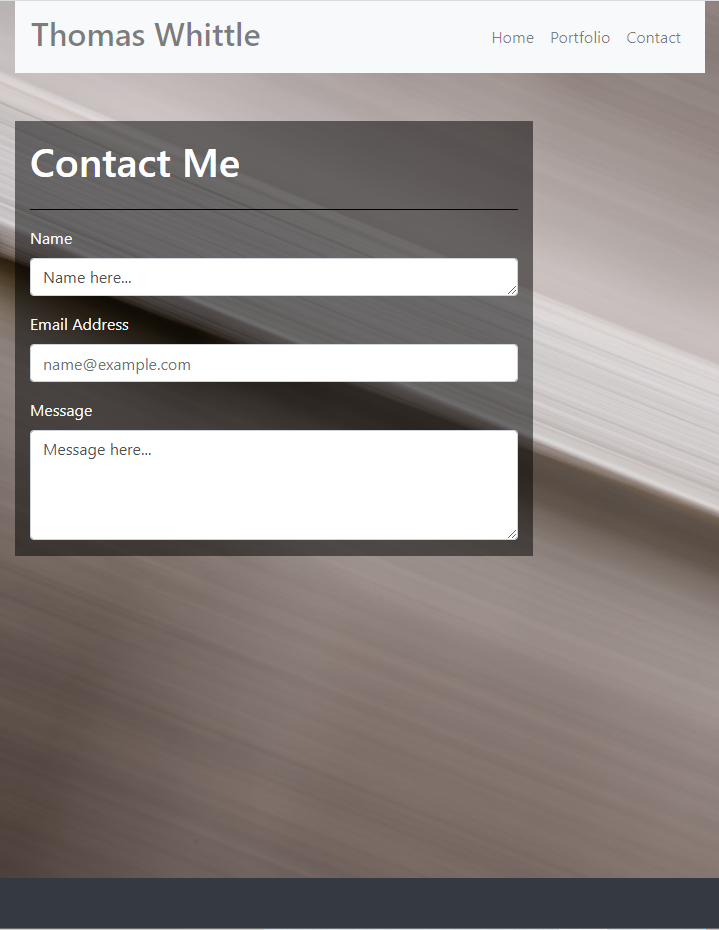

# Thomas Whittle Portfolio Website

## Introduction
   I have built a portfolio website to showcase my personal and
professional accomplishments related to my field using Bootstrap 4,
HTML5, and CSS. I have taken care to ensure smooth, responsive transitions between varying viewport sizes.

### Technologies
Project uses the following languages/frameworks:
* HTML 5
* CSS
* Bootstrap 4

#### Contributing
All coding and design done by me, Thomas Whittle
